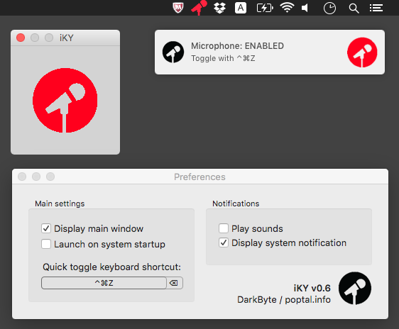
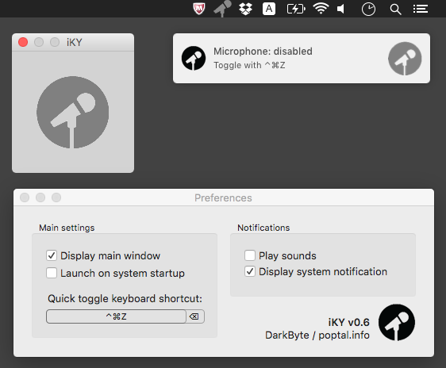

# iKY
Ever been in an endless hangouts/webex/you-name-it meeting? Ever cheated on it by resuming to code only to be brought back to reality by someone mentioning your name and asking you a question? Frantically looking for the un-mute button on the conference application view is not my idea of fun. iKY was born as a solution to this problem.

Screenshots below (main window, user notification, preferences window, menu bar icon):

ON state

OFF state

